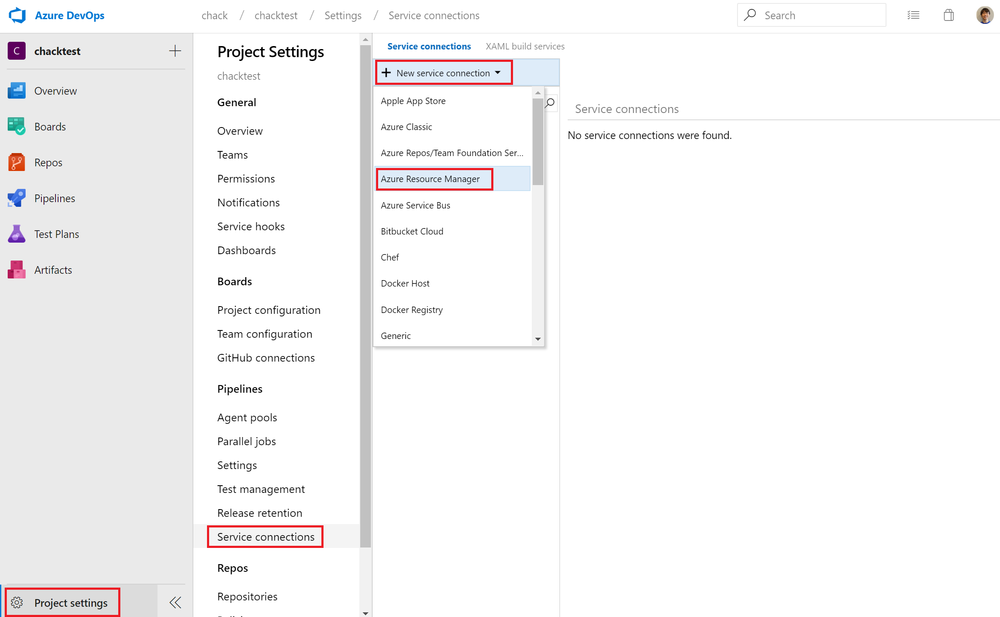
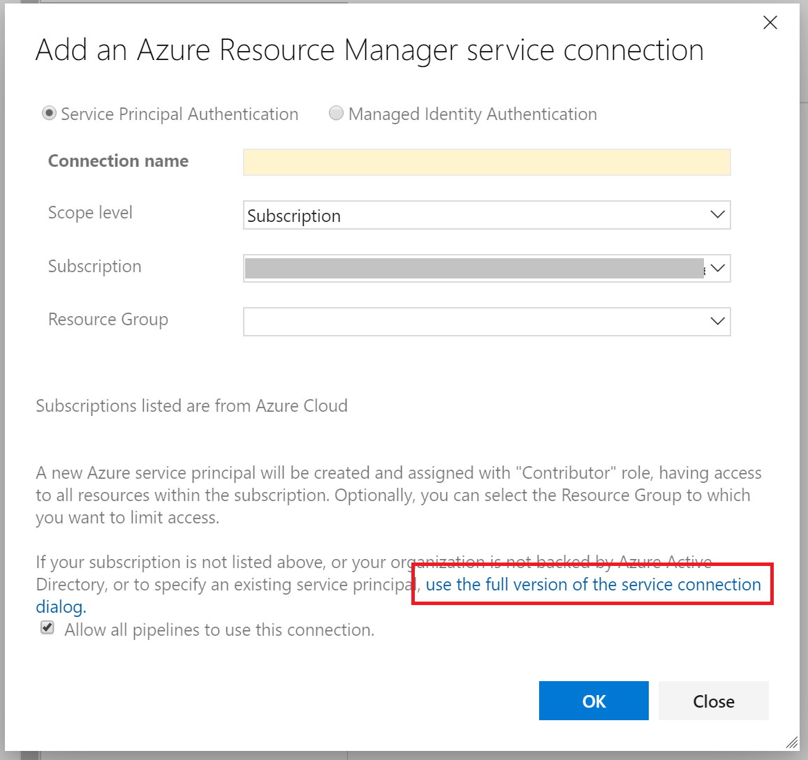
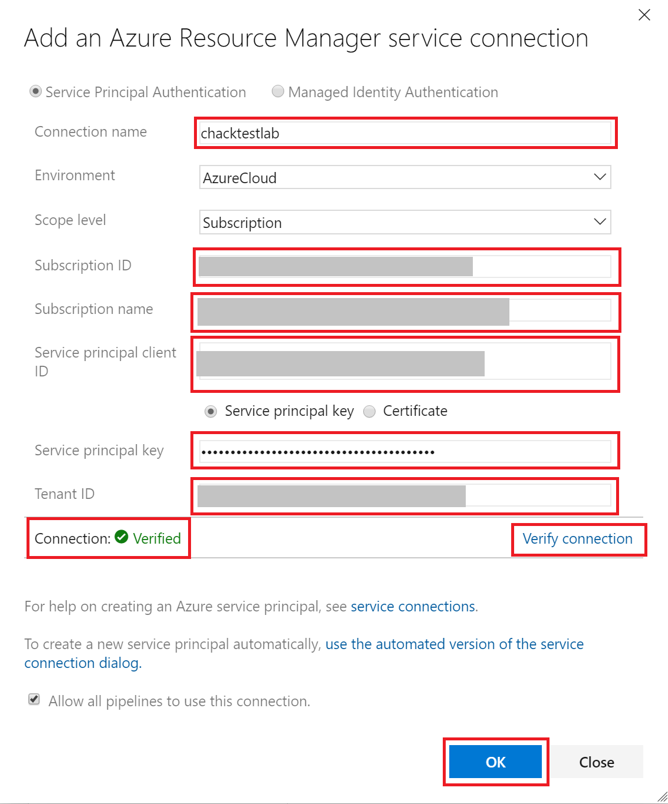
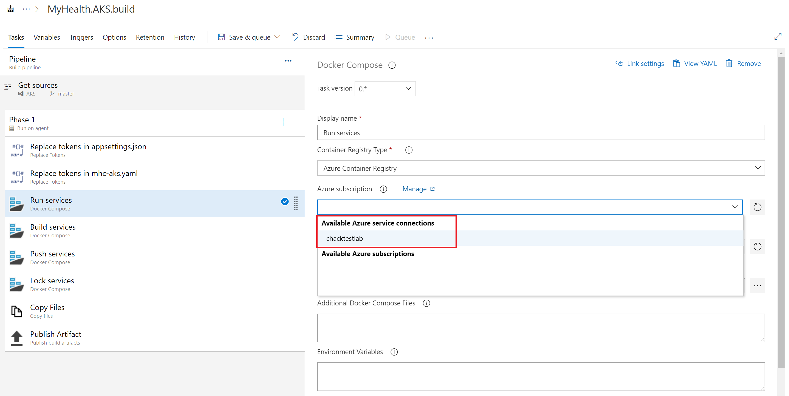

# 手動で Azure DevOps の Azure Service Connection を作成する

> 本手順は、Windows PowerShell 環境で作業してください

Azure DevOps のビルドタスクなどで、Azure subscription 名がドロップダウンリストに表示されなかったり、認証でエラーになるなどで、Azure への Service connection の作成が自動で行えない場合は、以下の手順に沿って手動で Service connection を作成します。

1. 管理者権限で Windows PowerShell を開き、次のコマンドを実行します

```bash
PS C:\>　Set-ExecutionPolicy -ExecutionPolicy RemoteSigned
```

2. 次に、こちらの [SPNCreation.ps1](https://github.com/chack411/AKSDevOpsLab_MHC/blob/master/documentation/SPNCreation.ps1) スクリプトをローカル環境の任意の場所へダウンロードして実行します。続いて、Azure サブスクリプション名の入力を求められるので、使用する Azure の管理ポータル等からサブスクリプション名を調べて入力します。

```bash
PS C:\> .\SPNCreation.ps1

コマンド パイプライン位置 1 のコマンドレット SPNCreation.ps1
次のパラメーターに値を指定してください:
(ヘルプを表示するには、「!?」と入力してください。)
subscriptionName: <Azure subscription name>
```
3. Azure サブスクリプションへの認証ウィンドウが開きますので、アカウント情報を入力してログインします。認証が行われると、Azure サブスクリプションにサービスプリンシパルが作成され、次の出力が得られます。

```bash
**********************************************
Connection Name: (SPN)
Environment: AzureCloud
Scope Level: Subscription
Subscription Id: <subscription-id>
Subscription Name:
Service Principal Id: <service-principal-id>
Service Principal key: <service-principal-key>
Tenant Id: <tenant-id>
**********************************************
```

4. **Azure DevOps** のプロジェクトを開き、**Project setting** - **Service conntections** を表示します。続いて **+ New service connection** をクリックし、**Azure Resource Manager** を選択します。

    

5. **Add an Azure Resource Manager service connection** ダイアログが表示されますので、**use the full version of the service connection dialog.** をクリックします。

    

6. 続いて表示されるダイアログで、任意の **Connection name** を入力します。加えて、**Subscription ID**, **Subscription name** を入力するとともに、手順 3 で取得した `<service-principal-id>` を **Service principal client ID** に、`<service-principal-key>` を **Service principal key** に、そして `<tenant-id>` を **Tenant ID** に、それぞれ入力します。そして、**Verify connection** をクリックして、Connection が **Verified** になることを確認してから OK ボタンをクリックします。

    

7. ビルドパイプラインに戻り、各タスクの **Azure subscription** ドロップダウンリストから、手順 6 で入力した名前の Service connections を選択します。

    

## 関連情報
- [Connect to Microsoft Azure](https://docs.microsoft.com/en-us/azure/devops/pipelines/library/connect-to-azure?view=azure-devops&viewFallbackFrom=vsts)
- [About Execution Policies](https://docs.microsoft.com/ja-jp/powershell/module/microsoft.powershell.core/about/about_execution_policies?view=powershell-6)

---
[Back](../readme.md)
