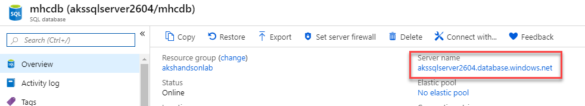
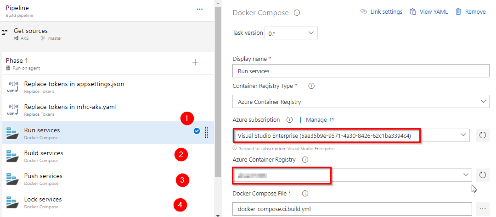
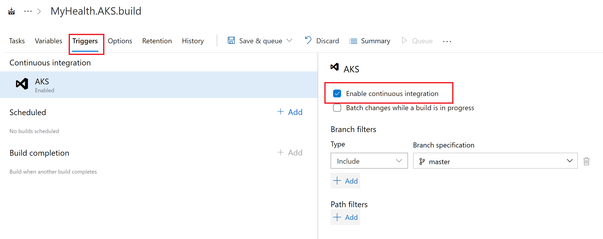
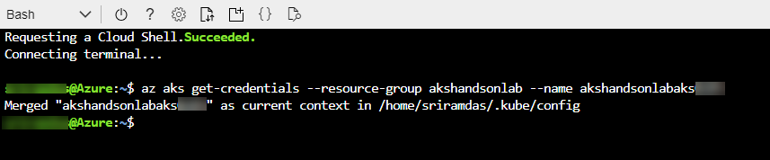

# Azure DevOps を利用した AKS へのマルチコンテナーアプリケーションの CI/CD 構成

> Original lab in English is: [Deploying a multi-container application to Azure Kubernetes Services](https://github.com/microsoft/azuredevopslabs/tree/master/labs/vstsextend/kubernetes)

## 概要

[**Azure Kubernetes Service (AKS)**](https://azure.microsoft.com/en-us/services/kubernetes-service/) は、Azure で Kubernetes を使用する最も簡単な方法です。**Azure Kubernetes Service (AKS)** は、ホストされた Kubernetes 環境を管理し、コンテナー オーケストレーションの専門知識を持たずに、コンテナー化されたアプリケーションを迅速かつ簡単にデプロイおよび管理できるようにします。また、アプリケーションをオフラインにすることなく、リソースをオンデマンドでプロビジョニング、アップグレード、およびスケーリングすることにより、継続的な運用と保守の負担を軽減します。Azure DevOps は、継続的なビルド オプションを使用して、デプロイと信頼性を向上させる Docker イメージの作成に役立ちます。
AKS を使用する最大の利点の 1 つは、クラウドでリソースを作成する代わりに、デプロイとサービス マニフェスト ファイルを通じて Azure Kubernetes クラスター内にリソースとインフラストラクチャを作成できることです。

### ラボ シナリオ

このラボでは、Docker 化された ASP.NET Core Web アプリケーションである **MyHealthClinic** (MHC) を使用し、**Azure DevOps** を使用して**Azure Kubernetes Service (AKS)** で実行されている **Kubernetes** クラスターにデプロイします。
> フロントの **Load Balancer** やバックエンドの **Redis Cache** などのデプロイメントとサービスをスピンアップするための定義で構成される **mhc-aks.yaml** マニフェスト ファイルがあります。MHC アプリケーションは、ロード バランサーと共に **mhc-front** ポッドで実行されます。
       


Kubernetes を初めて使用する方向けに、この実習で使用する用語説明のリンクが [こちら](documentation/terminology.md) にまとめられています。

### このラボで取り上げる内容

次のタスクを実習します。

* Azure Container Registry (ACR), AKS and Azure SQL server の作成

* Azure DevOps Demo Generator ツールを利用した .NET Core アプリケーションの Azure DevOps チーム プロジェクトをプロビジョニングする

* Azure DevOps の継続的デプロイ (CD) を使用して、アプリケーションとデータベースのデプロイを構成する

* Azure Boards でのワークアイテム作成から Pull Request によるソースコード修正によるアプリケーションの自動ビルドとデプロイの基本的なワークフローをおこなう

## 環境準備

1. [はじめに](setup.md) を参照して、この演習に必要な事前準備を確認します。

2. [Azure DevOps デモ ジェネレータ](https://azuredevopsdemogenerator.azurewebsites.net/?TemplateId=77372&Name=AKS) リンクをクリックし、ベースとなるデモプロジェクトを **Azure DevOps** にプロビジョニングします。

このラボでは、上記のリンクをクリックすると既に選択されている **Azure Kubernetes Service** テンプレートが使用されます。この演習には、いくつかの追加の拡張機能が必要であり、プロセス中に自動的にインストールできます。


## 環境のセットアップ

このラボでは次の Azure のリソースの構成が必要になります。

|Azure resources                      | Description|
|-------------------------------------|------------|
| Azure Container Registry | プライベートな Docker イメージの格納に使用します |
| AKS | Azure 上に構成されるマネージドな Kubernetes サービスで、AKS 内のポッドに Docker イメージがデプロイされます|
| Azure SQL Dtabase | Azure 上に構成されるマネージドな SQL データベース サービスです|

### Azure Cloud Shell を使った Azure リソースの準備

1. Azure 管理ポータルで [Azure Cloud Shell](https://docs.microsoft.com/en-in/azure/cloud-shell/overview) を開き、**Bash** を選択します。

2. **CLI を使った AKS の作成**:

   i. ご希望のリージョンで利用可能な最新の Kubernetes バージョンを bash 変数に取得します。本演習では `japaneast` (東日本) のデータセンター リージョンの利用を前提にしていますが、もし他のリージョン (例えば `japanwest` ) などを利用したい場合には、各コマンドの `japaneast` 文字列を書き換えてください。

      ```bash
     version=$(az aks get-versions -l japaneast --query 'orchestrators[-1].orchestratorVersion' -o tsv)
      ```
   
   ii. リソースグループ `akshandsonlab` を作成します。

    ```bash
     az group create --name akshandsonlab --location japaneast
    ```

   iii. AKS を作成します。

    ```bash
    az aks create --resource-group akshandsonlab \
        --kubernetes-version $version \
        --location japaneast \
        --enable-addons monitoring \
        --generate-ssh-keys \
        --node-vm-size Standard_DS1_v2 \
        --name <unique-aks-cluster-name>
    ```
    
    `<unique-aks-cluster-name>` に一意の AKS クラスター名を入力します。AKS 名には、3 - 31 文字数で、文字、数字、およびハイフンのみを含めることができます。名前は文字で始まる必要があり、文字または数字で終わる必要があります。AKS の展開には 10 - 15 分かかる場合があります。

    > もし、AKS クラスター作成でエラーになる場合、[こちら](documentation/create_AKS.md) の手順を試してみてください。こちらの手順では、より詳細な AKS クラスター作成手順が書かれています。
    
3. **Azure Container Registry(ACR) の作成**:
   
   次のコマンドを実行して、Azure コンテナー レジストリ (ACR) を使用したプライベート コンテナー レジストリを作成します。

    ```bash
    az acr create --resource-group akshandsonlab --name <unique-acr-name> --sku Standard --location japaneast
    ```
    `<unique-acr-name>` に一意の ACR 名を入力します。ACR 名には英数字のみを含める場合があり、5 - 50 文字の間でなければなりません。

4. **AKS サービス プリンシパル アクセスを ACR に付与する**:
   
   AKS サービス プリンシパルを使用して、AKS クラスターが Azure コンテナー レジストリ (ACR) に接続することを承認します。`<aks-cluster-name>` と `<acr-name>` を先に作成した名前に置き換え、以下のコマンドを実行します。

    ```bash
    # Get the id of the service principal configured for AKS
    CLIENT_ID=$(az aks show --resource-group akshandsonlab --name <aks-cluster-name> --query "servicePrincipalProfile.clientId" --output tsv)

    # Get the ACR registry resource id
    ACR_ID=$(az acr show --name <acr-name> --resource-group akshandsonlab --query "id" --output tsv)

   # Create role assignment
   az role assignment create --assignee $CLIENT_ID --role acrpull --scope $ACR_ID
   ```

   > 詳細な情報はこちらのドキュメントも参照してください：[Authenticate with Azure Container Registry from Azure Kubernetes Service](https://docs.microsoft.com/en-us/azure/container-registry/container-registry-auth-aks)

5. **Azure SQL Database の作成**:
   
   次のコマンドを実行して Azure SQL Database サーバーを作成します。
   
   `<unique-sqlserver-name>` には一意の Azure SQL Database サーバー名を入力します。サーバー名は大文字を使用した命名規則 (Camel 形式など) をサポートしていないため、全て小文字を使用します。
    
    ```bash
    az sql server create -l japaneast -g akshandsonlab -n <unique-sqlserver-name> -u sqladmin -p P2ssw0rd1234
    ```
    
    続いて、次のコマンドを実行してデータベースを作成します。

    `<unique-sqlserver-name>` には、先に作成した SQL Database サーバー名を指定します。

    ```bash
    az sql db create -g akshandsonlab -s <unique-sqlserver-name> -n mhcdb --service-objective Basic --max-size 100MB
    ```

    次に、SQL Database サーバーのファイアウォールの設定を行います。次のコマンドを実行して、Azure サービスからのアクセスを許可します。

    ```bash
    az sql server firewall-rule create -g akshandsonlab -s <unique-sqlserver-name> -n AllowAllWindowsAzureIps --start-ip-address 0.0.0.0 --end-ip-address 0.0.0.0
    ```

6. 以上で次のコンポーネント - **Azure コンテナー レジストリ (ACR)**、**Azure Kubernetes Service (AKS)**、**Azure SQL Database** が展開されます。これらの各コンポーネントに個別にアクセスし、演習 1 で使用する詳細をメモします。
   
   

7. SQL Database の **mhcdb** を選択して、**サーバー名** をメモします。

   

8. リソース グループに移動し、作成されたコンテナー レジストリを選択し、**ログイン サーバー** 名をメモします。

    

これで、このラボの演習をおこなうために必要なすべての Azure リソースの準備が完了しました。

## 演習 1: ビルド & リリース パイプラインの構成

[Azure DevOps デモ ジェネレータ](https://azuredevopsdemogenerator.azurewebsites.net/?TemplateId=77372&Name=AKS) を通じて、Azure DevOps 組織で AKS プロジェクトを作成していることを確認します (詳細は環境準備の章を参照してください)。AKS や Azure コンテナー レジストリ (ACR) などの Azure リソースをビルド定義とリリース定義に手動でマップします。

1. Azure DevOps で作成したチームプロジェクトを開き、**Pipelines → Pipelines** を表示します。

      

> もしも、**Pipelines** の下に **Builds** と表示されている場合は、Azure DevOps の右上隅にあるアカウントアイコンをクリックし、**Preview features** の **Multi-stage pipelines** を ON にします。

2. **MyHealth.AKS.build** pipeline を選択して **Edit** をクリックします。
   
   

3. **Run services** タスクで、**Azure subscription** ドロップダウンリストから使用する Azure サブスクリプションを選択して、**Authorize** をクリックします。

    

    Azure 資格情報との接続の認証を求められます。[OK] ボタンをクリックした後に空白の画面が表示された場合は、ブラウザでポップアップ ブロッカーを無効にし、手順を再試行してください。

    これにより、サービス プリンシパル認証 (SPA) を使用して Microsoft Azure サブスクリプションへの接続を定義し、合わせてセキュリティで保護する **Azure Resource Manager Service Endpoint** が作成されます。このエンドポイントは、**Azure DevOps** および **Azure** の接続に使用されます。

    > サブスクリプションが一覧表示されていない場合、または既存のサービス プリンシパルを指定する場合は、[サービス プリンシパルの作成](https://docs.microsoft.com/en-us/azure/devops/pipelines/library/connect-to-azure?view=vsts) を参照してください。

4. 認証が成功した後、ドロップダウン - **Azure subscription** および **Azure Container Registry** で適切な値を選択します。

5. パイプライン内の **Build services**、**Push services**、および **Lock services** タスクについてもこの手順を繰り返します。

    

    各ビルドタスクの概要は下記の通りです。

    |Tasks|Usage|
    |-----|-----|
    |**Replace tokens**| **mhc-aks.yaml** 内の ACR 名と **appsettings.json** 内のデータベース接続文字列を置き換えます|
    | **Run services**| aspnetcore-build:1.0-2.0 などの必要なイメージをプルして、**.csproj** で記述されているパッケージを復元することで、ビルドに適切な環境を準備します|
    | **Build services**| **docker-compose.yml** ファイルで指定された Docker イメージをビルドし、**$(Build.BuildId)** と **latest** のタグを追加します|
    | **Push services**| Docker イメージ **myhealth.web** を Azure Container Registry (ACR) にプッシュします|
    | **Publish Build Artifacts**| **mhc-aks.yaml** と **myhealth.dacpac** ファイルを Azure DevOps 内の Artifact ドロップ場所にプッシュし、リリース定義で使用できるようにします|

    > **applicationsettings.json** ファイルには、この演習の冒頭で作成された Azure Database への接続に使用されるデータベース接続文字列の詳細が含まれています。

   > **mhc-aks.yaml** マニフェスト ファイルには、Azure Kubernetes Service (AKS) にデプロイされる **deployments**、**services**、**pods** の構成の詳細が含まれています。マニフェスト ファイルは次のようになります。

      

   > Deployment Manifest についての詳細な情報はこちらをご参照ください：[AKS Deployments and YAML manifests](https://docs.microsoft.com/en-us/azure/aks/concepts-clusters-workloads#deployments-and-yaml-manifests)

6. **Variables** タブをクリックします
      
    

    **Pipeline Variables** で使用する **ACR** および **SQLserver** の値を、環境のセットアップの章でサービスを作成した時に指定した名前で更新します。

    

7. **Triggers** タブをクリックします
      
    初期設定では **Enable continuous integration** が Off になっていますので、この設定にチェックを入れて、リポジトリのソースコードが変更されたタイミングで自動でビルドパイプラインが実行されるようにします (演習 3 で動作を確認します)。

    

8. **Save & queue** の **Save** (Save & queue ではない) をクリックして変更を保存します

    

9. **Pipelines \| Releases** に移動し、 **MyHealth.AKS.Release** pipeline を選択して **Edit** をクリックします

   

10. **Dev** stage を選択して **View stage tasks** をクリックし、パイプライン タスクを表示します

   

11. **Dev** 環境では、まず **DB deployment** フェーズをクリックして **Agent pool** のドロップダウンから **Azure Pipelines** を選択し、
**Agent Specification** ドロップダウンから **windows-2019** を選択します。

    

1. 続いて **DB deployment** フェーズの **Execute Azure SQL: DacpacTask** タスクにある **Azure Service Connection Type** のドロップダウンから **Azure Resource Manager** を選択し、
**Azure Subscription** ドロップダウンから **Available Azure service connections** に表示される Azure サブスクリプションへの接続名を選択します。

    

12. 次に **AKS deployment** フェーズをクリックして **Agent pool** のドロップダウンから **Azure Pipelines** を選択し、
**Agent Specification** ドロップダウンから **ubuntu-16.04** を選択します。

    

1. **AKS deployment** フェーズの **Create Deployments & Services in AKS** タスクを選択します。
      
    

    **Azure subscription**、**Resource Group**、**Kubernetes cluster** の各ドロップダウンリストの値を更新します。続いて **Secrets** セクションを開き、 **Azure subscription** と **Azure container registry** の値をドロップダウンから更新します。
    
    **Update image in AKS** タスクにおいても同様の設定を行います。
     
     
    
    > **Create Deployments & Services in AKS** タスクは **mhc-aks.yaml** ファイルで指定された構成に従い、AKS に deployments と services を作成します。最初のポッドは最新の Docker イメージがプルされて作成されます。

    > **Update image in AKS** は、指定されたリポジトリから BuildID に対応する適切なイメージをプルアップし、AKSで実行されている**mhc-front pod** に Docker イメージをデプロイします。

    > **mysecretkey** という secret が、コマンド `kubectl create secret` を使用して、Azure DevOps を介してバックグラウンドで AKS クラスターに作成されます。この secret は、Azure コンテナー レジストリ (ACR) から `myhealth.web` イメージを取得する場合の認証に使用されます。

2. リリース定義の **Variables** セクション タブを選択し、**Pipeline Variables** にある **ACR** と **SQLserver** の値を、環境のセットアップの章でサービスを作成した時に指定した名前で更新し、**Save** ボタンをクリックします。
   
   > **Database Name** は **mhcdb** に、**Server Admin Login** は **sqladmin** に、**Password** は **P2ssw0rd1234** に設定されています。もし、Azure SQL Database サーバーの作成中に異なる詳細を入力した場合は、それに応じて値を更新します。

   

## 演習 2: ビルドとデプロイの実行

この演習では、アプリケーションのビルドを手動実行し、完了すると自動デプロイが実行されることを確認します。このアプリケーションは、フロントエンドに **load balancer** を、バックエンドに **Redis cache** を含むポッドに展開するように設計されています。

1. **MyHealth.AKS.build** pipeline を選択して、**Run pipeline** をクリックします。

    

2. ビルド プロセスが開始されたら、ビルド ジョブを選択して、ビルドの進行状況を確認します。
    
    

3. ビルド タスクは、Docker イメージを生成して ACR にプッシュします。ビルドが完了すると、ビルドの概要が表示されます。生成されたイメージを Azure ポータルで確認するには、**Azure コンテナー レジストリ** を選択し、**リポジトリ** を表示します。

    

4. Azure DevOps ポータルの **Pipelines** セクションで **Releases** タブを選択し、最新リリースをクリックします。**In progress** リンクをクリックすると、ライブ ログとリリースの概要が表示されます。

    

    

5. リリースタスクが完了したら、[Azure Cloud Shell](https://docs.microsoft.com/en-in/azure/cloud-shell/overview) を開き、次のコマンドを実行して AKS のポッドを確認します。

   まずはじめに、Kubernetes クラスターに接続するための資格情報を取得します。 `aks-cluster-name` は実際に演習で作成した名前を指定します。
   
    ```bash
    az aks get-credentials --resource-group akshandsonlab --name <aks-cluster-name>
    ```
     

   続いて、次のコマンドを実行すると、実行中のポッドが一覧表示されます。

    ```bash
    kubectl get pods
    ```
    

6. アプリケーションを表示するには、次のコマンドを実行して外部 IP アドレスを確認します。もし、**EXTERNAL-IP** が pending 状態の場合は、IP アドレスがアサインされるまで待ちます。
   
    ```bash
    kubectl get service mhc-front --watch
    ```
    

7. **EXTERNAL-IP** をコピーして、ブラウザーで表示します。次のようなアプリケーションが表示されます。

    

### (補足) Azure Kubernetes Service (AKS) で Kubernetes Web ダッシュボードにアクセスする

Kubernetes には、基本的な管理操作に使用できる Web ダッシュボードが用意されています。このダッシュボードでは、アプリケーションの基本的な正常性ステータスとメトリックを表示したり、サービスを作成して展開したり、既存のアプリケーションを編集したりできます。Azure Kubernetes Service (AKS) の Kubernetes Web ダッシュボードにアクセスするには、[こちらの手順](https://docs.microsoft.com/en-us/azure/aks/kubernetes-dashboard) を参照してください。


## 演習 3: Work Item の作成からソースコードを修正して CI/CD を実行する

TBD

## 演習 4: 演習で使用したリソースを削除する

演習が完了したら、次のコマンドを使って、リソース グループ、コンテナー サービス、およびすべての関連リソースを削除します。

```bash
az group delete --name akshandsonlab --yes --no-wait
```

> リソースを使用し続ける場合には削除しなくても構いませんが、継続して課金がされることに注意してください。

> AKS クラスターを削除しても、クラスターで使用されていた Azure Active Directory サービス プリンシパルは削除されません。サービス プリンシパルを削除する手順については、[AKS のサービス プリンシパルに関する考慮事項と削除](https://docs.microsoft.com/ja-jp/azure/aks/kubernetes-service-principal#additional-considerations) に関するページを参照してください。

## まとめ

[**Azure Kubernetes Service (AKS)**](https://azure.microsoft.com/en-us/services/container-service/) は、その責任の大部分を Azure にオフロードすることで、Kubernetes クラスターの管理の複雑さと運用上のオーバーヘッドを軽減します。合わせて、**Azure DevOps** および **Azure コンテナー レジストリ (ACR)** を使用すると、Docker アプリケーション用の DevOps 環境を構築できます。

## Reference

TBD
