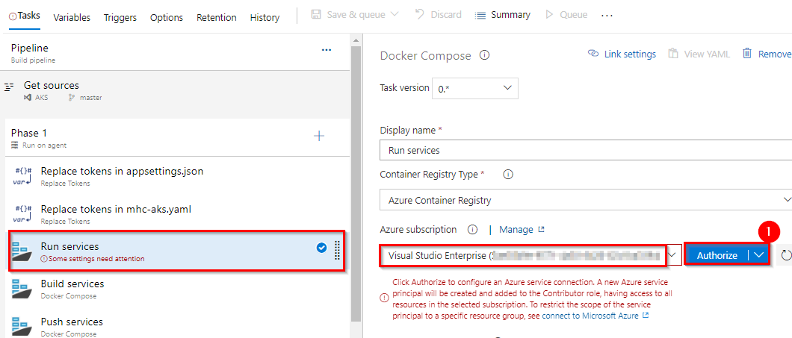
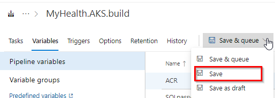
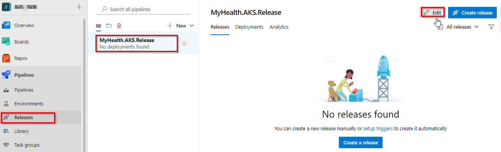
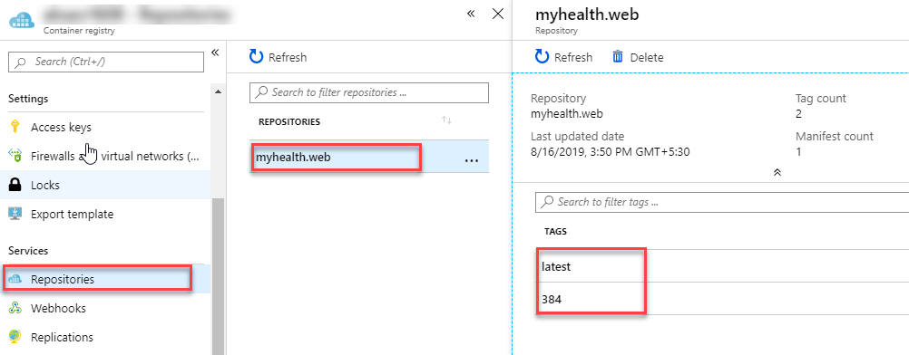
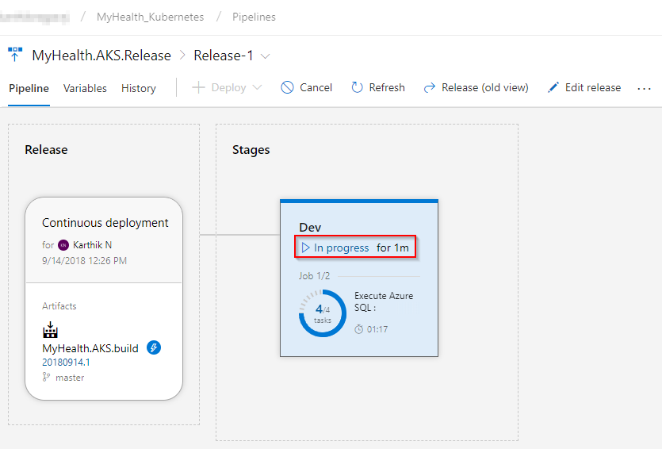
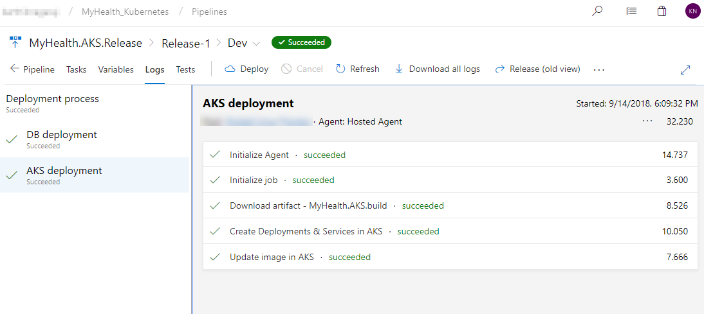

# Azure DevOps を利用した AKS へのマルチコンテナーアプリケーションの CI/CD 構成

> Original lab in English is: [Deploying a multi-container application to Azure Kubernetes Services](https://github.com/microsoft/azuredevopslabs/tree/master/labs/vstsextend/kubernetes)

## 概要

[**Azure Kubernetes Service (AKS)**](https://azure.microsoft.com/en-us/services/kubernetes-service/) は、Azure で Kubernetes を使用する最も簡単な方法です。**Azure Kubernetes Service (AKS)** は、ホストされた Kubernetes 環境を管理し、コンテナー オーケストレーションの専門知識を持たずに、コンテナー化されたアプリケーションを迅速かつ簡単にデプロイおよび管理できるようにします。また、アプリケーションをオフラインにすることなく、リソースをオンデマンドでプロビジョニング、アップグレード、およびスケーリングすることにより、継続的な運用と保守の負担を軽減します。Azure DevOps は、継続的なビルド オプションを使用して、デプロイと信頼性を向上させる Docker イメージの作成に役立ちます。
AKS を使用する最大の利点の 1 つは、クラウドでリソースを作成する代わりに、デプロイとサービス マニフェスト ファイルを通じて Azure Kubernetes クラスター内にリソースとインフラストラクチャを作成できることです。

### ラボ シナリオ

このラボでは、Docker 化された ASP.NET Core Web アプリケーションである **MyHealthClinic** (MHC) を使用し、**Azure DevOps** を使用して**Azure Kubernetes Service (AKS)** で実行されている **Kubernetes** クラスターにデプロイします。
> フロントの **Load Balancer** やバックエンドの **Redis Cache** などのデプロイメントとサービスをスピンアップするための定義で構成される **mhc-aks.yaml** マニフェスト ファイルがあります。MHC アプリケーションは、ロード バランサーと共に **mhc-front** ポッドで実行されます。
       


Kubernetes を初めて使用する方向けに、この実習で使用する用語説明のリンクが [こちら](documentation/readme.md) にまとめられています。

### このラボで取り上げる内容

次のタスクを実習します。

* Azure Container Registry (ACR), AKS and Azure SQL server の作成

* Azure DevOps Demo Generator ツールを利用した .NET Core アプリケーションの Azure DevOps チーム プロジェクトをプロビジョニングする

* Azure DevOps の継続的デプロイ (CD) を使用して、アプリケーションとデータベースのデプロイを構成する

* Azure Boards でのワークアイテム作成から Pull Request によるソースコード修正によるアプリケーションの自動ビルドとデプロイの基本的なワークフローをおこなう

## 環境準備

1. [はじめに](../Setup/) を参照して、この演習に必要な事前準備を確認します。

2. [Azure DevOps デモ ジェネレータ](http://azuredevopsdemogenerator.azureweb.net/?TemplateId=77372&Name=AKS) リンクをクリックし、ベースとなるデモプロジェクトを **Azure DevOps** にプロビジョニングします。

このラボでは、上記のリンクをクリックすると既に選択されている **Azure Kubernetes Service** テンプレートが使用されます。この演習には、いくつかの追加の拡張機能が必要であり、プロセス中に自動的にインストールできます。


## 環境のセットアップ

このラボでは次の Azure のリソースの構成が必要になります。

|Azure resources                      | Description|
|-------------------------------------|------------|
| Azure Container Registry | プライベートな Docker イメージの格納に使用します |
| AKS | Azure 上に構成されるマネージドな Kubernetes サービスで、AKS 内のポッドに Docker イメージがデプロイされます|
| Azure SQL Dtabase | Azure 上に構成されるマネージドな SQL データベース サービスです|

### Azure Cloud Shell を使った Azure リソースの準備

1. Azure 管理ポータルで [Azure Cloud Shell](https://docs.microsoft.com/en-in/azure/cloud-shell/overview) を開き、**Bash** を選択します。

2. **CLI を使った AKS の作成**:

   i. ご希望のリージョンで利用可能な最新の Kubernetes バージョンを bash 変数に取得します。`<region>` を使用したいデータセンターリージョン (例えば `japaneast` ) に置き換えます。

      ```bash
     version=$(az aks get-versions -l <region> --query 'orchestrators[-1].orchestratorVersion' -o tsv)
      ```
   
   ii. リソースグループ `akshandsonlab` を作成します。

    ```bash
     az group create --name akshandsonlab --location <region>
    ```

   iii. AKS を作成します。

    ```bash
    az aks create --resource-group akshandsonlab --name <unique-aks-cluster-name> --enable-addons monitoring --kubernetes-version $version --generate-ssh-keys --location <region>　--node-vm-size Standard_DS1_v2
    ```
    
    `<unique-aks-cluster-name>` に一意の AKS クラスター名を入力します。AKS 名には、3 - 31 文字数で、文字、数字、およびハイフンのみを含めることができます。名前は文字で始まる必要があり、文字または数字で終わる必要があります。AKS の展開には 10 - 15 分かかる場合があります。
    
3. **Azure Container Registry(ACR) の作成**:
   
   次のコマンドを実行して、Azure コンテナー レジストリ (ACR) を使用したプライベート コンテナー レジストリを作成します。

    ```bash
    az acr create --resource-group akshandsonlab --name <unique-acr-name> --sku Standard --location <region>
    ```
    `<unique-acr-name>` に一意の ACR 名を入力します。ACR 名には英数字のみを含める場合があり、5 - 50 文字の間でなければなりません。

4. **AKS サービス プリンシパル アクセスを ACR に付与する**:
   
   AKS サービス プリンシパルを使用して、AKS クラスターが Azure コンテナー レジストリ (ACR) に接続することを承認します。`<aks-cluster-name>` と `<acr-name>` を先に作成した名前に置き換え、以下のコマンドを実行します。

    ```bash
    # Get the id of the service principal configured for AKS
    CLIENT_ID=$(az aks show --resource-group akshandsonlab --name <aks-cluster-name> --query "servicePrincipalProfile.clientId" --output tsv)

    # Get the ACR registry resource id
    ACR_ID=$(az acr show --name <acr-name> --resource-group akshandsonlab --query "id" --output tsv)

   # Create role assignment
   az role assignment create --assignee $CLIENT_ID --role acrpull --scope $ACR_ID
   ```

   > 詳細な情報はこちらのドキュメントも参照してください：[Authenticate with Azure Container Registry from Azure Kubernetes Service](https://docs.microsoft.com/en-us/azure/container-registry/container-registry-auth-aks)

5. **Azure SQL Database の作成**:
   
   次のコマンドを実行して Azure SQL Database サーバーを作成します。
   
   `<unique-sqlserver-name>` には一意の Azure SQL Database サーバー名を入力します。サーバー名は大文字を使用した命名規則 (Camel 形式など) をサポートしていないため、全て小文字を使用します。
    
    ```bash
    az sql server create -l <region> -g akshandsonlab -n <unique-sqlserver-name> -u sqladmin -p P2ssw0rd1234
    ```
    
    続いて、次のコマンドを実行してデータベースを作成します。

    `<unique-sqlserver-name>` には、先に作成した SQL Database サーバー名を指定します。

    ```bash
    az sql db create -g akshandsonlab -s <unique-sqlserver-name> -n mhcdb --service-objective Basic --max-size 100M
    ```

6. 以上で次のコンポーネント - **Azure コンテナー レジストリ (ACR)**、**Azure Kubernetes Service (AKS)**、**Azure SQL Database** が展開されます。これらの各コンポーネントに個別にアクセスし、演習 1 で使用する詳細をメモします。
   
   

7. SQL Database の **mhcdb** を選択して、**サーバー名** をメモします。

   

8. リソース グループに移動し、作成されたコンテナー レジストリを選択し、**ログイン サーバー** 名をメモします。

    

これで、このラボの演習をおこなうために必要なすべての Azure リソースの準備が完了しました。

## Exercise 1: Configure Build and Release pipeline

Make sure that you have created the AKS project in your Azure DevOps organization through [Azure DevOps Demo Generator](http://azuredevopsdemogenerator.azurewebsites.net/?TemplateId=77372&Name=AKS) (as mentioned in pre-requisites). We will manually map Azure resources such as AKS and Azure Container Registry to the build and release definitions.

1. Navigate to **Pipelines --> Pipelines**. 
   
      

2. Select **MyHealth.AKS.Build** pipeline and click **Edit**.
   
   

3. In **Run services** task, select your Azure subscription from **Azure subscription** dropdown. Click **Authorize**.

    

    You will be prompted to authorize this connection with Azure credentials. Disable pop-up blocker in your browser if you see a blank screen after clicking the OK button, and please retry the step.

     This creates an **Azure Resource Manager Service Endpoint**, which defines and secures a connection to a Microsoft Azure subscription, using Service Principal Authentication (SPA). This endpoint will be used to connect **Azure DevOps** and **Azure**.

     

4. Following the successful authentication, select appropriate values from the dropdown - **Azure subscription** and **Azure Container Registry** as shown. 

   Repeat this for the **Build services, Push services** and **Lock services** tasks in the pipeline. 

    


    |Tasks|Usage|
    |-----|-----|
    |**Replace tokens**| replace ACR in **mhc-aks.yaml** and database connection string in **appsettings.json**|
    | **Run services**| prepares suitable environment by pulling required image such as aspnetcore-build:1.0-2.0 and restoring packages mentioned in **.csproj**|
    | **Build services**| builds the docker images specified in a **docker-compose.yml** file and tags images with **$(Build.BuildId)** and **latest**|
    | **Push services**| pushes the docker image **myhealth.web** to Azure Container Registry|
    | **Publish Build Artifacts**| publishes **mhc-aks.yaml** & **myhealth.dacpac** files to artifact drop location in Azure DevOps so that they can be utilized in Release Definition|

    **applicationsettings.json** file contains details of the database connection string used to connect to Azure database which was created in the beginning of this lab.
    
   > **mhc-aks.yaml** manifest file contains configuration details of **deployments**, **services** and **pods** which will be deployed in Azure Kubernetes Service. The manifest file will look like as below

      

   > For more information on the deployment manifest, see [AKS Deployments and YAML manifests](https://docs.microsoft.com/en-us/azure/aks/concepts-clusters-workloads#deployments-and-yaml-manifests)

5. Click on the **Variables** tab.
      
    

     Update **ACR** and **SQLserver** values for **Pipeline Variables** with the details noted earlier while configuring the environment. 
    

6. **Save** the changes.

    

7. Navigate to **Pipelines \| Releases**. Select **MyHealth.AKS.Release** pipeline and click **Edit**.

   

8. Select Dev stage and click **View stage tasks** to view the pipeline tasks.

   

9. In the **Dev** environment, under the **DB deployment** phase, select **Azure Resource Manager** from the drop down for **Azure Service Connection Type**,  update the **Azure Subscription** value from the dropdown for **Execute Azure SQL: DacpacTask** task.

    

10. In the **AKS deployment** phase, select **Create Deployments & Services in AKS** task. 
      
    

    Update the **Azure Subscription**, **Resource Group** and **Kubernetes cluster** from the dropdown. Expand the **Secrets** section and update the parameters for **Azure subscription** and **Azure container registry** from the dropdown. 
    
    Repeat similar steps for **Update image in AKS** task.
     
     
    

    * **Create Deployments & Services in AKS** will create the deployments and services in AKS as per the configuration specified in **mhc-aks.yaml** file. The Pod, for the first time will pull up the latest docker image.

    * **Update image in AKS** will pull up the appropriate image corresponding to the BuildID from the repository specified, and deploys the docker image to the **mhc-front pod** running in AKS.

    * A secret called **mysecretkey** is created in AKS cluster through Azure DevOps by using command `kubectl create secret` in the background. This secret will be used for authorization while pulling myhealth.web image from the Azure Container Registry.


11. Select the **Variables** section under the release definition, update **ACR** and **SQLserver** values for **Pipeline Variables** with the details noted earlier while configuring the environment. Select the **Save** button.

   

   

## Exercise 2: Trigger a Build and deploy application

In this exercise, let us trigger a build manually and upon completion, an automatic deployment of the application will be triggered. Our application is designed to be deployed in the pod with the **load balancer** in the front-end and **Redis cache** in the back-end.

1. Select **MyHealth.AKS.build** pipeline. Click on **Run pipeline**

    

1. Once the build process starts, select the build job to see the build in progress.
    
    
    

1. The build will generate and push the docker image to ACR. After the build is completed, you will see the build summary. To view the generated images navigate to the Azure Portal, select the **Azure Container Registry** and navigate to the **Repositories**.

    

1. Switch back to the Azure DevOps portal. Select the **Releases** tab in the **Pipelines** section and double-click on the latest release. Select **In progress** link to see the live logs and release summary.

    

    

1. Once the release is complete, launch the [Azure Cloud Shell](https://docs.microsoft.com/en-in/azure/cloud-shell/overview) and run the below commands to see the pods running in AKS:

    1. Type **`az aks get-credentials --resource-group yourResourceGroup --name yourAKSname`** in the command prompt to get the access credentials for the Kubernetes cluster. Replace the variables `yourResourceGroup` and `yourAKSname` with the actual values.

         

    1. **`kubectl get pods`**

        

        The deployed web application is running in the displayed pods.

1. To access the application, run the below command. If you see that **External-IP** is pending, wait for sometime until an IP is assigned.

    **`kubectl get service mhc-front --watch`**

    

1. Copy the **External-IP** and paste it in the browser and press the Enter button to launch the application.

    

### Access the Kubernetes web dashboard in Azure Kubernetes Service (AKS)

Kubernetes includes a web dashboard that can be used for basic management operations. This dashboard lets you view basic health status and metrics for your applications, create and deploy services, and edit existing applications. Follow [these instructions](https://docs.microsoft.com/en-us/azure/aks/kubernetes-dashboard) to access the Kubernetes web dashboard in Azure Kubernetes Service (AKS).


## Summary

[**Azure Kubernetes Service (AKS)**](https://azure.microsoft.com/en-us/services/container-service/){:target="_blank"}  reduces the complexity and operational overhead of managing a Kubernetes cluster by offloading much of that responsibility to the Azure. With **Azure DevOps** and **Azure Container Services (AKS)**, we can build DevOps for dockerized applications by leveraging docker capabilities enabled on Azure DevOps Hosted Agents.


## Reference

Thanks to **Mohamed Radwan** for making a video on this lab. You can watch the following video that walks you through all the steps explained in this lab

<figure class="video_container">
  <iframe width="560" height="315" src="https://www.youtube.com/embed/4DUhc0MjdUc" frameborder="0" allowfullscreen="true"> </iframe>
</figure>

